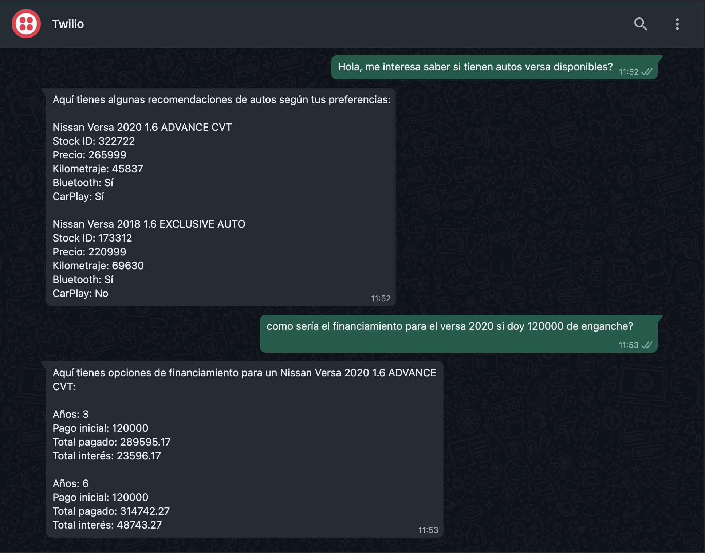

# kavak-bot

## Prerequisites

- Docker
- Twilio account
- ngrok

## Instructions

- Create `.env` file with the followinf environment variables:

```
LLM_API_KEY=<your-llm-api-key>
LLM_API_URL=<your-llm-url>
KAVAK_URL=https://www.kavak.com/mx/blog/sedes-de-kavak-en-mexico
LLM_OPTION=<your-llm-option>
TWILIO_ACCOUNT_SID=<twilio-sid>
TWILIO_AUTH_TOKEN=<twilio-auth-token>
TWILIO_FROM_WHATSAPP_NUMBER=<twilio-sandbox-whatsapp-number>
```

- To build Docker image (from repository root folder):

```
docker build -t kavak-bot .
```

- To run app container:

```
docker-compose up -d
```

- To stop container

```
docker-compose down
```

- Once application is running, initialize the local DB by sending "sample_caso_ai_engineer.csv" to `POST /api/init-db`:

```
curl --request POST \
  --url http://127.0.0.1:8000/api/init-db \
  --header 'content-type: multipart/form-data' \
  --form file=@file
```

- Configure ngrok locally and execute:

```
ngrok http http://localhost:8000
```

- Copy the ngrok url and add `/api/chat` fragment to it. Then, paste this in your Twilio sandbox:

```
https://<your-ngrok-identifier>/api/chat
```

- Interact with kavak-bot using Whatsapp :)

### Example


